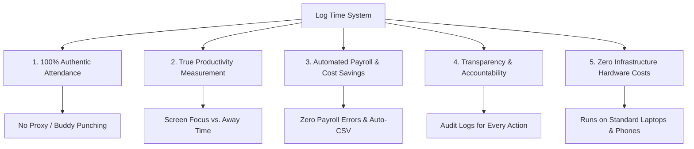

# 📄 Enterprise Project Documentation
## **Log Time — AI Biometric Attendance & Workstation Monitoring System**

---

## 📌 Executive Summary
**Log Time** is an advanced, enterprise-grade automated time-tracking, attendance, and workstation productivity monitoring application. Leveraging on-device deep learning facial recognition (**`face-api.js` / TensorFlow.js**), real-time gaze detection, automated shift counters, and dynamic salary computation, the platform guarantees **authentic attendance**, eliminates **buddy-punching**, and delivers high-precision workforce intelligence across four role-based access tiers (**Employee**, **Team Lead**, **HR Manager**, and **System Administrator**).

---

## 🎯 Primary Use Cases

### 1. 👤 Biometric Face Authentication & Attendance (Anti-Proxy / Anti-Buddy Punching)
* **Use Case**: Employees log in to their daily shift using their live camera feed. The system extracts a 128-dimensional facial embedding and compares it against their enrolled profile photo using Euclidean vector distance.
* **Workflow**:
  1. Employee enters their credentials.
  2. The system prompts for a live camera scan.
  3. `face-api.js` models (`tinyFaceDetector`, `faceLandmark68TinyNet`, `faceRecognitionNet`) detect the face and compute a biometric match score.
  4. On successful verification ($>85\%$ match), the shift timer starts automatically, and a voice welcome greets the employee.

---

### 2. ⏱️ Real-Time Focus & Gaze Orientation Tracking
* **Use Case**: Distinguish between actual productive work (facing the workstation screen) vs. idle/distracted periods (looking away, leaving the workstation).
* **Metrics Tracked with 1-Second Precision**:
  * **Straight-Forward Laptop Use**: Time spent with head and face oriented directly at the monitor.
  * **Total Active Workstation Time**: Cumulative logged-in shift hours.
  * **Looking Away / Idle Time**: Gaze turned left/right or face absent from camera frame.
  * **Remaining Shift Countdown**: Live countdown to the standard 8.5-hour workday completion.

---

### 3. 🛡️ Desktop Distraction & Tab-Switch Guard
* **Use Case**: Discourage unauthorized website browsing (e.g., social media, video streaming) during active work sessions.
* **Mechanism**:
  * Listens to browser `visibilitychange` events when an employee switches tabs or minimizes the window.
  * Emits an audible warning tone and displays a toast notification.
  * Automatically logs a `DISTRACTION_DETECTED` event to the centralized database and audit log.

---

### 4. 👥 Role-Segregated Management Portals

| Portal | Target User | Key Capabilities |
| :--- | :--- | :--- |
| **Employee Portal** | All Staff | Live session HUD, focus percentage score, work break toggling, personal attendance history, password self-service. |
| **Team Lead (TL) Portal** | Team Leads / Supervisors | Real-time monitoring of team members' active/away status, team gaze metrics, daily team attendance reviews. |
| **HR Portal** | HR Managers | Employee onboarding, profile updates, department/team allocation, attendance auditing, shift compliance monitoring. |
| **Admin Portal** | System Admins / Executives | Full system oversight, security controls, live system audit logs, automated payroll engine, database inspector, and CSV data export. |

---

### 5. 💰 Automated Daily & Monthly Salary Calculation
* **Use Case**: Compute exact daily earned wages and monthly salaries based on verified logged hours vs. target work hours (8.5 hrs/day).
* **Features**:
  * Role-based default salaries with individual employee salary overrides.
  * Real-time calculation: $\text{Daily Earned} = \left(\frac{\text{Monthly Base}}{\text{Days in Month}}\right) \times \min\left(1, \frac{\text{Worked Seconds}}{\text{Target Seconds}}\right)$.
  * One-click CSV export of comprehensive payroll and attendance records.

---

### 6. 📱 Universal Multi-Platform Deployment
* **Use Case**: Seamless usage on office desktops, laptops, tablets, and field mobile devices.
* **Platforms**:
  * **Web Application**: Accessible via any modern web browser.
  * **Android Native App (APK)**: Packaged via Capacitor with native camera permissions and offline local storage.

---

## 🌟 Business & Operational Benefits

### 1. 🚫 Elimination of Proxy Attendance & Time Theft
* **Problem**: Traditional RFID cards, PIN codes, or manual registers are vulnerable to buddy punching.
* **Benefit**: Biometric facial recognition guarantees that only the actual employee can clock in and claim work hours.

### 2. 📊 Transparent, Fact-Based Productivity Insights
* **Problem**: Regular time trackers only measure whether a computer is unlocked, not if the user is actually working.
* **Benefit**: Gaze orientation analysis provides objective data on active screen engagement versus looking away or leaving the desk.

### 3. 💵 Accurate, Automated Payroll & Overhead Reduction
* **Problem**: Manual calculation of attendance hours, breaks, and pro-rated pay is time-consuming and error-prone.
* **Benefit**: Instant mathematical computation of earned daily wages based on exact verified seconds, exportable directly to payroll spreadsheets.

### 4. 🔒 Enterprise Security & Complete Auditability
* **Problem**: Unmonitored credential sharing or unauthorized privilege escalation.
* **Benefit**: Every login, logout, face verification attempt, password reset, and tab distraction is permanently recorded with timestamps in the **System Audit Log**.

### 5. 💡 Zero Dedicated Hardware Expenses
* **Problem**: Traditional biometric scanners require expensive biometric hardware units and maintenance.
* **Benefit**: Runs directly in standard web browsers and standard Android mobile cameras using client-side AI.

---

## 🏗️ Technical Architecture & Stack

* **Frontend Framework**: React 19 + TypeScript
* **Build System & Bundler**: Vite 8
* **AI / Facial Recognition Engine**: `face-api.js` (TensorFlow.js Core)
  * *Tiny Face Detector* (Bounding boxes)
  * *Face Landmark 68 Net* (Facial landmarks & gaze)
  * *Face Recognition Net* (128-D vector embeddings)
* **Styling & UI**: Custom Vanilla CSS Glassmorphism Design System
* **Icons**: Lucide React
* **Mobile Runtime**: Capacitor 7 (Android SDK 36, Java 21)
* **Local Data Persistence**: High-speed JSON Local Storage Engine with schema auto-seeding
* **Deployment Pipelines**: GitHub Actions CI/CD (Web Pages & Android APK compilation)

---

## 📋 System Summary Table

| Feature | Log Time | Traditional Punch Clock | Basic Time Tracker |
| :--- | :---: | :---: | :---: |
| **Biometric Face Verification** | ✅ Yes (AI Deep Learning) | ❌ No / Hardware Only | ❌ No |
| **Gaze & Focus Level Tracking** | ✅ Yes (Real-Time) | ❌ No | ❌ No |
| **Proxy Attendance Prevention** | ✅ 100% | ❌ Vulnerable | ❌ Vulnerable |
| **4-Tier Role Governance** | ✅ Admin, HR, TL, Emp | ❌ Single Level | ❌ Limited |
| **Dynamic Payroll Computation** | ✅ Instant + CSV Export | ❌ Manual | ❌ Manual |
| **Works on Mobile & Browser** | ✅ Yes | ❌ Fixed Hardware | ⚠️ Web Only |
